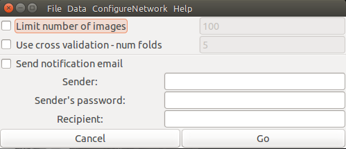

Train Network Manual
---
>This manual will explain the process of how to use train a network. This essentially takes a batch of images and their corresponding traces and helps train Autotrace to better predict contours of the tongue.

>there are two versions of __Train Network__. For this we will be using __Train Network 2__

 + In the `Autotrace/matlab-version` directory, Launch __Train Network 2__ with the following command `python TrainNetwork2.py`

  
 + In the __Data__ dropdown menu, specify the training data that is compiled in the folder by clicking on the subject's folder then clicking _open_
  + Be sure to select both the __Subject1__ and __traces__ folders. 
  + Check that __ROI_config.txt__ is in the Subject1/ folder
 + Select __send email notification__

 > This will send an email once the program is done running. It may take hours or even days depending on the system, number of images, an other variables. You should adjust your settings so that your computer does not fall asleep.

 > For further information on this program and the other programs mentioned above, you should refer to the dissertation by Jeff Berry.

