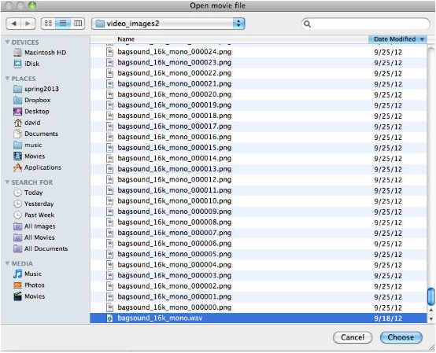
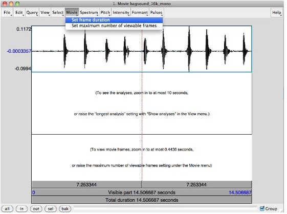
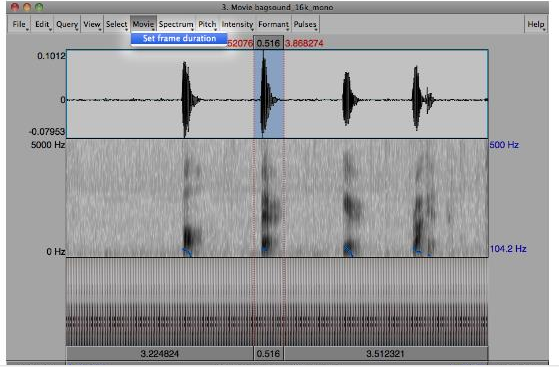

UltraPraat
===

Beginning Praat
---

 + Locate the __Praat__ program on computer

 + Open UltraPraat (View the code [here](../UltraPraat))
 
Using Praat with Video
---
>Praat is a software program capable of taking audio information and converting that information to spectrograms and waveforms. These instructions are for using Praat concurrently with video information so that the user can track video along with auditory information. This manual assumes the user has basic working knowledge of Praat and knows how to record sound, edit sound, etc.

Opening Video
---
 + In Praat, open a __.wav__ movie file  

 + Under __open__, select __open movie file…__
 
 

 >Important: Associated file must have __.png__ files in order to view frames along with sound. These __.png__ files also must have the exact beginning name as __.wav__ file before final dash or underscore
 

Viewing and Editing
---
 + Click __view and edit__
 + You must be zoomed in to a certain point in order to view the Ultrasound frames

 + A new window will open

 + Identify section of interest from audio file in the standard way (it can be the entire file)

 + Select __query__

 + Select __get frames for selection__

 + Under __view and edit__, select __movie__

 + Set frame duration to change length of time each fame is given

 >Note: Praat assumes frames are evenly spaced

 + These settings revert to standard settings (approximately 30 fps) when a new file is opened
 