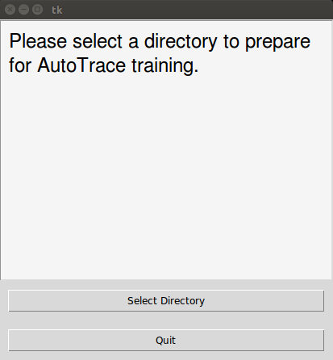
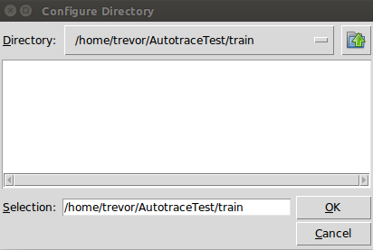

Configdir.py
===
>This script arranges training data into the directory
    structure that TrainNetwork.py expects.

Usage
---
+ run [configdir.py](../configdir.py) by typing `python configdir.py`

+ Select the _train_ directory created by ImageDiversity

+ Running this script produces the directories __Subject1/__, __traces/__ and __Subject1/IMAGES/__, as well as __TongueContours.csv__.
+ __ROI_config.txt__    is moved into __Subject1/__.

