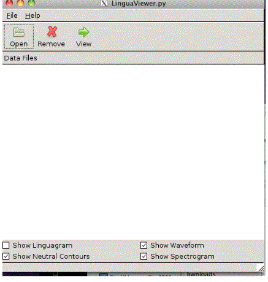
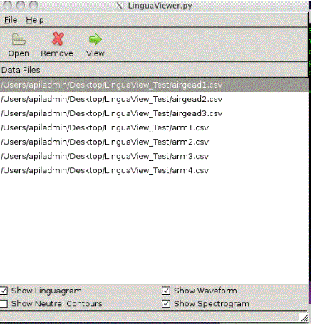

Using LinguaView
===
 > LinguaView is used for visualizing results and analysis. LinguaView creates a visual that includes a Linguagram, Waveform, and Spectrogram into one page.

Opening LinguaView
---
 + Locate the __LinguaView__ folder

 + Open [LinguaView.py](../LinguaView.py)

 + The terminal should open first and then the program itself will open

Locating Files and Setting up the LinguaView
---
 >LinguaView will not work unless it has __.csv__ files to work with

 + The __.csv__ file contains the coordinates for the traced tongue

 + A __.wav__ file corresponds with these coordinates

 + Click __open__ and locate the __.csv__ files you would like to work with

 > The file names for the __.csv__ file and the __.wav__ files should be matching

 + In the bottom bar of the window, there are four boxes that can be checked

 + Select __Show Linguagram__

 > This contains the ultrasound image and a 3D map of the tongue contours

 + Also select __Show Waveform__ and __Show Spectogram__

 + The __Show Neutral Contours__ box should remain unselected

 > This uses a file type that is not in use anymore so it is very important that it is not selected

 + Click on the file you would like to view first
 
 

 + Then click __View__

 + A new window should pop up

Viewing a Linguagram
---
 + The new window should appear something like this:
 
 

 + The top colored image is the Linguagram

 + This image can be rotated by clicking and _dragging_ to see all possible sides and angles of the tongue

 + The colors correspond to tongue height, with red being the highest point of the tongue and blue being the lowest

 + The tongue tip is the bottom of the image

 + The back of the tongue is the top of the image

 + The middle image is the Waveform

 + The bottom image is the Spectrogram

 + You can play the sound by clicking __Play__ sound in the upper left corner of the screen

To label segments of the Linguagram
---
 + Create lines the surround the desired sounds

 + Click on the section of the Linguagram you would like to label

 + Type the label of choice and hit _enter_

 + To save this just click __save__ in the upper left corner

 > Note- if __save__ label doesn’t work, take a screen shot instead