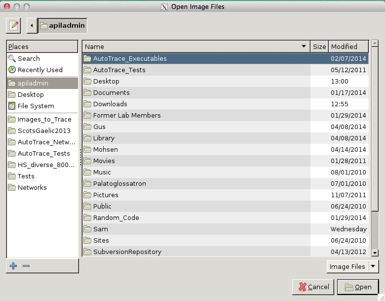

Training a Network
===
>This manual will explain the process of how to train a network. This essentially takes a batch of images and their corresponding traces and helps train Autotrace to better predict contours of the tongue. 

Select ROI
---
 >This script is designed to help the user select a region of interest
	to use with the set of images selected by the user. The boundaries
	can be set either by clicking and dragging, or with the text entry 
	boxes. When this script is run, it will look for a config file called
	ROI_config.txt that specifies the region of interest. If no such file
	exists, it will be created when the user presses 'Save'. Saving will
	overwrite any previous information in ROI_config.txt.
	ROI_config.txt will be used by other scripts, such as image_diversity.py, 
	Autotrace.py, and TrainNetwork.py.
	
 + Open __Select ROI__
 + To do this open the __terminal__
 + Open a new tab within the __terminal__
 + Type `CD Gus ~/Gus.Autotrace/old/ python Select ROI`

+ Open [SelectROI.py](../SelectROI.py)
+ The terminal will open followed by an __Open Image Files__ screen.

+ Select the images you would like to average and click __open__

Image Diversity NEW
---
>This script measures the distance from average for each image in the
	input set, and copies the specified number of highest scoring images
	to a new folder called 'diverse'. If ROI_config.txt is present in the 
	same folder as the input images, the ROI in that file will be used to 
	do the measurement. If not present, it will use a hard-coded default ROI.
	
+ Open [Image Diversity](../image_diversityNEW.py)

 + _open_ image files
 >Note: this program filters so that only images can be selected, and once you click _open_ it may take a while. 
 + It will then ask for corresponding traces to match the images
 + Hit _open_ once you ahve selected the corresponding traces
 + The main screen tells the number of images selected
 + Specify the number for training and testing
 >_training_ is the first time it runs through, and then the number you _test_ comes from the _training_ batch
 + specify the numer of _most diverse_ and _least diverse_
 > _most diverse_ will select images that vary greatly in their tongue contours, while _least diverse_ will select images that all have similar tongue contours

 + That will reduce the numbr of overall images based on your specifications
 + Select the ratio of _most diverse_ to _least diverse_ 
 + From this you can select a __test set__
 + __batches for remaining__ is simply all of the images that you have not selected to train with, and they will go into a folderentitled __remaining__
 > Note: if an __error__ during this part of the process occurs then some settings may be missing
 + Save to your folder of choice
 + Click __OK__
 + From this a graph will open 
 > This shows __Diversity Scores__ on the Y axis. Diversity scores will be higher if you have more diverse images and vice versa for least diverse. On the X axis it simply ranks the numbers based on their order.
 + You can save this graph if you would like or take a screenshot
 + the program will close automatically when it is done running
 + Open the folder where you specified to have the images
 > in this folder there will be several other new folders. __batch remaining__ is the folder discussed above. __diversity log__ is the record of what happened in the file move. __sorted results__ are the scores for each image.

Configdir
---
>This script arranges training data into the directory
    structure that TrainNetwork.py expects.
    
+ Open [configdir.py](../configdir.py)

+ run the script: python configdir.py
+  This file should be placed in the directory with the __.jpg/.png__
    and corresponding __.traced.txt__ files, as well as __ROI_config.txt.__
+ Running this script produces the directories __Subject1/__, __traces/__ and __Subject1/IMAGES/__, as well as __TongueContours.csv__. 
+ __ROI_config.txt__
    is moved into __Subject1/__.

Train Network
---
>there are two versions of __Train Network__. For this we will be using __Train Network 2__

 + Launch __Train Network 2__
 + In the __Data__ section, specify the training data that is compiled in the folder by clicking on the subject's folder then clicking _open_
 + Select __send email notification__
 
 > This will send an email once the program is done running. It may take hours or even days depending on the system, number of images, an other variables. You should adjust your settings so that your computer does not fall asleep. 

 > For further information on this program and the other programs mentioned above, you should refer to the dissertation by Jeff Berry. 

Autotrace
---
 + Open __Autotrace__
 + Load the network 
 + Select iamges and click _open_
 + Once you lick this __Matlab__ will start